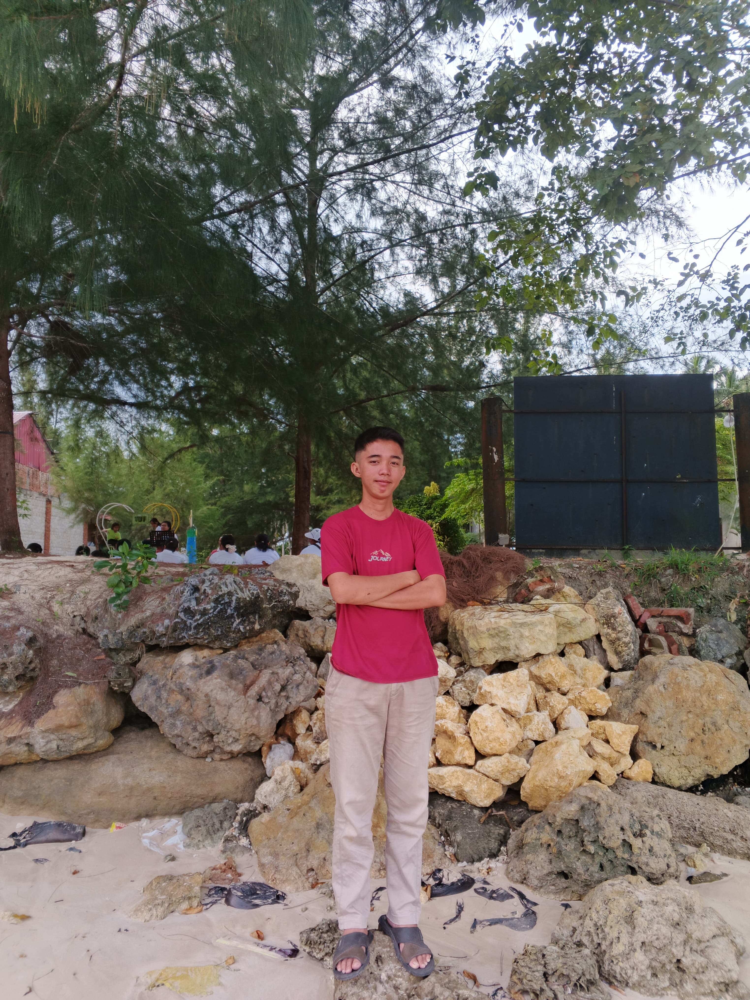
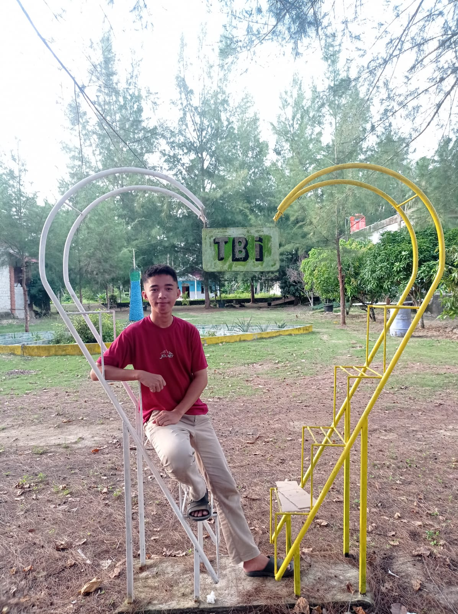
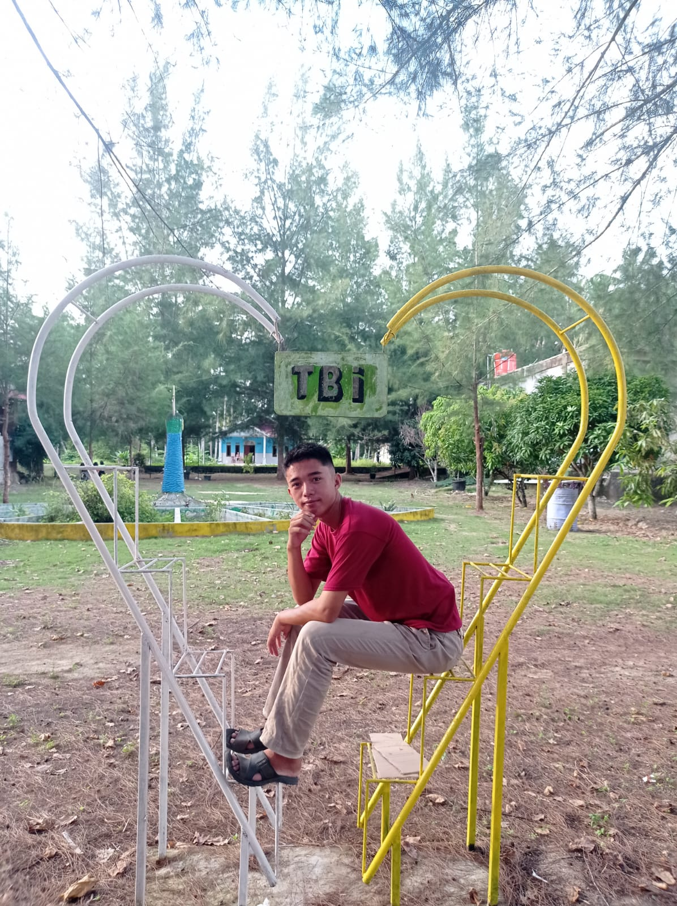

<!DOCTYPE html>
<html lang="id">
<head>
    <meta charset="UTF-8">
    <meta name="viewport" content="width=device-width, initial-scale=1.0">
    <title>Daniel Noxctrya Cyber - Official Website</title>
    
</head>
<body>

    <!-- Sidebar -->
    <aside class="sidebar">
        
        <h2>Daniel Noxctrya</h2>
        <ul class="menu-nav">
            <li><a onclick="showSection('home')">Home</a></li>
            <li><a onclick="showSection('profile')">Profile</a></li>
            <li><a onclick="showSection('aktivitas')">Aktivitas</a></li>
            <li><a onclick="showSection('gambar')">Gambar</a></li>
            <li><a onclick="showSection('puisi')">Puisi</a></li>
            <li><a href="mailto:danieldolarsarumaha14@gmail.com">Email</a></li>
        </ul>
    </aside>

    <!-- Konten -->
    <main class="main-content">
        
        <!-- Section: HOME -->
        <section id="home" class="active">
            

                <h1>WELCOME TO MY WEBSITE</h1>
                

                
<i>Saya ucapkan terimakasih atas dukungan anda dan kunjungan anda terhadap website saya.</i>

                

                    
<strong>Aku dan Tuhanku</strong>

                    <i>ketika aku memandang langit... 
                    aku bertanya pada diriku sendiri... 
                    siapakah aku sebenarnya? 
                    darimanakah aku berasal?</i>
                

            

        </section>

        <!-- Section: PROFILE -->
        <section id="profile">
            

                <h2>Profile Daniel</h2>
                
Nama Lengkap: <strong>Daniel Dolar Sarumaha</strong>

                
Saya adalah seorang pengembang web yang berdedikasi untuk menciptakan website berstandar internasional. Fokus utama saya adalah pada fungsionalitas dan estetika digital.

                
<strong>Media Sosial:</strong> 
                Instagram: @DanielDolarSar 
                Facebook: Daniel Sarumaha 
				Whatsapp : +6282261500043

            

        </section>

        <!-- Section: AKTIVITAS -->
        <section id="aktivitas">
            

                <h2>Aktivitas Terbaru</h2>
                <ul>
                    <li><strong>Proyek Website:</strong> menciptakan sebuah website standar ddengan menggunakan css</li>
                    <li><strong>Edukasi:</strong> Mendalami teknik akselerasi memori untuk memahami logika pemrograman lebih cepat.</li>
                    <li><strong>Teknologi:</strong> Eksperimen infrastruktur database menggunakan Firebase.</li>
                </ul>
            

        </section>

        <!-- Section: GAMBAR -->
        <section id="gambar">
            

                <h2>Galeri Gambar</h2>
                    
					
            

        </section>

        <!-- Section: PUISI -->
        <section id="puisi">
            

                <h2 style="text-align: center;">Karya Puisi</h2>
                

                    
<strong>Aku dan Tuhanku</strong>

                    ketika aku memandang langit 
                    aku bertanya pada diriku sendiri 
                    aku....  
                    siapakah aku sebenarnya? 
                    darimanakah aku berasal? 
                    jauhkah aku dari tuhanku? 
                    aku...  
                    Tuhan.... 
                    betapa kuasanya engkau 
                    menciptakan langit dan bumi 
                    untuk menghidupi orang-orang 
                    seperti aku
                

				<tr>
				

					
<strong>IBU</strong>

					Di matamu, aku menemukan telaga teduh 
					Tempatku membasuh segala lelah dan keluh 
					Tak perlu kata, kau tahu kapan hatiku rapuh 
					Hanya dengan usapan, duniaku kembali utuh. 
					 
					Kau adalah doa yang terbang paling pagi 
					Mengetuk pintu langit sebelum matahari bersemi 
					Meminta keselamatan bagi langkahku yang seringkali 
					Lupa jalan pulang karena terlalu sibuk mencari diri. 
					 
					Ibu, kau adalah rumah yang tak pernah terkunci 
					Meski aku pergi jauh dan berkali-kali menyakiti 
					Kasihmu tak berkurang, tetap tulus dan suci 
					Menjadi kompas saat aku kehilangan arah di bumi. 
            

        </section>
    </main>

</body>
</html>
